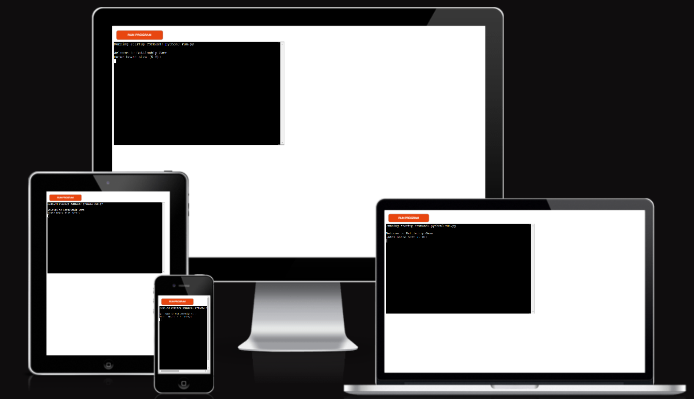

# Purpose
  Battleship game, players take turns guessing rows and columns on a board, aiming to destroy hidden ships. The board, represented by symbols, shows guesses and ship locations. Players place ships, and correct guesses mark hits. The game ends when all ships are destroyed.

  The Battleship game developed on the Python platform using the Code Institute template

# Responsive 
Responsive screen image for the different device, used https://ui.dev/amiresponsive website to capture the image. 

# How to Play the Battleship Game:
## Board Setup:
The game begins with you selecting a board size between 5x5 and 8x8.
Both you (the player) and the computer place ships randomly on your respective boards. You cannot see the computer’s ships, but you can see your own.
## Taking Turns:
On each turn, you guess the location of a hidden ship on the computer's board by entering a row and column number.
The computer will also randomly guess locations on your board.
## Game Objective:
The goal is to sink all of the computer's ships by correctly guessing their positions.
You win the game by hitting all the computer’s ships before the computer sinks all of yours or before your maximum number of attempts is reached.
## Symbols Used in the Game:
### $ (Default Symbol):
This is the symbol used to represent the empty spaces on the board where no guesses have been made yet.
### @ (Ship Symbol):
On your board, this symbol represents where your ships are located.
On the computer's board, you will not see this symbol unless ships are revealed at the end of the game.
### X (Hit):
This symbol appears on the board when a player guesses a location where a ship is present, indicating a successful hit.
### O (Miss):
This symbol is used when a player guesses a location where no ship is present, indicating a miss.
## Example Playthrough:
- You are prompted to enter guesses for row and column values.
- If you guess correctly, you’ll see an X marking the hit on the board.
- If you guess incorrectly, an O marks the missed attempt.
- The computer also takes turns guessing positions on your board.
- The game continues until all ships are destroyed or the maximum number of attempts is reached.

# Testing
I manually tested this project by completing the following tasks:

- Ran the code through a code institute CI Python Linter to ensure there were no issues.
- Tested with invalid inputs, such as non-numeric strings when numbers were required, inputs outside the valid range, and repeated inputs.
- Ran the tests in both my local terminal and the Code Institute's Heroku terminal.

# Bugs
## Fixed Bugs
Initially, in the start_game method, I used the same row and column guesses for both the players and the computer. As a result, when playing the game, the players' guesses on the computer's board were also being applied to their own board. To resolve this issue, I updated the code to use separate random row and column numbers for the players' board.
## Outstanding Bugs
No remaining bugs.

# Validator Testing
The code was validated against PEP8 standards with no errors found via code institute CI Python Linter.

# Deployment
## Deployment Steps:

- Log in to your Heroku account.
- Navigate to the Dashboard.
- Click the "New" button located in the top right corner and select "Create New App" from the dropdown menu.
- On the "Create New App" page, provide the required app name and select the desired country.
- Once the project page opens, click on the "Settings" tab.
- In the "Settings" section, configure the buildpacks in the following order: Python first, followed by NodeJS.
- Proceed to the "Deploy" tab. Under "Deployment Method," select "GitHub" and link your Heroku app to the GitHub repository.
- Enter the project name, search for the relevant Git repository, select it, and establish the connection.
- Under "Manual Deployment," choose the "main" branch and click "Deploy Branch."
- Once the deployment is complete, click "View" under the message indicating successful deployment.

# Credits
- I would like to thank, Harry(Mentor) for support for my project in reviewing and providing some guides.
- The structure and concept of the Battleships game were inspired by Code Institute's "Love Sandwiches" project, 
  the Battleship concept outlined in Code Institute's video,as well as resources from W3Schools for the quick check for the python functions.